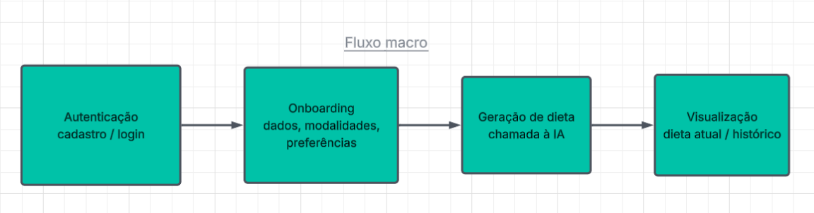
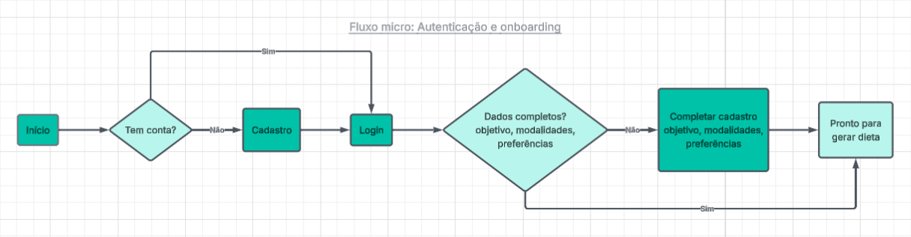
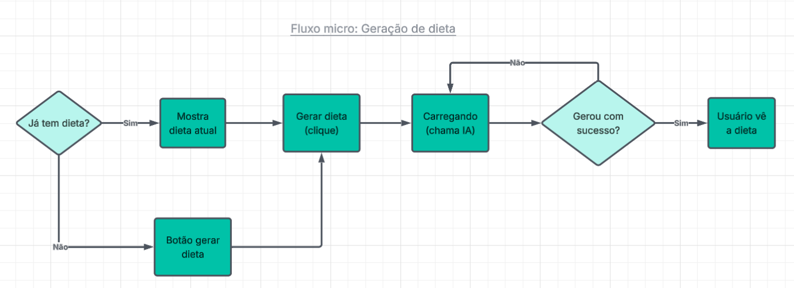
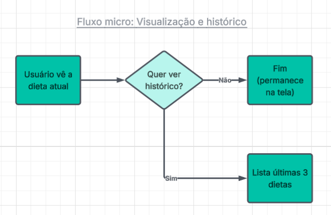

# Fluxogramas — Ronu (MVP)

Visão do fluxo de uso do Ronu, do fluxo macro (visão geral) até os fluxos micro de cada fase.

---

## Fluxo macro

Visão geral das 4 grandes fases da jornada do usuário, sem entrar em decisões.

---

## Fluxo micro: Autenticação e onboarding

Cobre as fases 1 e 2 do fluxo macro. O usuário faz cadastro ou login, e o sistema verifica se os dados corporais, modalidades e preferências alimentares já foram cadastrados antes de liberar a geração da dieta.

---

## Fluxo micro: Geração de dieta

Cobre a fase 3 do fluxo macro. O usuário aciona a geração (pela primeira vez ou gerando de novo), o sistema chama a API da Anthropic, e trata tanto o caminho de sucesso quanto o de erro (com opção de tentar novamente).

---

## Fluxo micro: Visualização e histórico

Cobre a fase 4 do fluxo macro. O usuário vê a dieta atual e pode opcionalmente consultar o histórico das últimas 3 dietas geradas.

